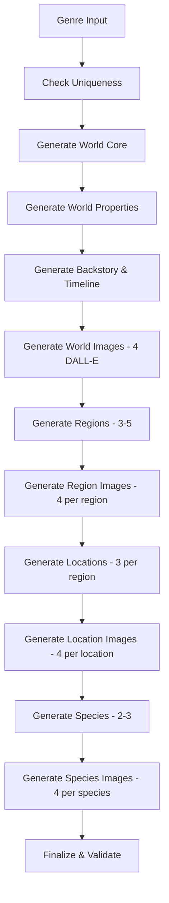

# World Factory Engine 🌍✨

## Overview

The **World Factory Engine** is an advanced AI-powered world generation system that uses **LangGraph**, **RabbitMQ**, and **Claude/GPT-4** to create comprehensive, richly detailed RPG worlds automatically. It orchestrates a multi-step workflow that generates everything from world lore to individual species, complete with AI-generated images.

## Architecture

### Core Components

1. **LangGraph Workflow Orchestrator** - State machine with 12 discrete, retriable steps
2. **RabbitMQ Event Bus** - Durable queues with retry and dead-letter queues
3. **MongoDB Audit Trail** - Complete execution history for transparency
4. **Redis Progress Tracking** - Real-time status updates
5. **Django REST API** - Frontend integration and job management

### Workflow Steps



## Generated Content

For each genre (e.g., "Fantasy", "Sci-Fi", "Cyberpunk"), the World Factory creates:

### World (Node 1-5)
- **Unique name** different from existing worlds
- **Description** (2-3 sentences)
- **Themes** (4-5 thematic elements)
- **Visual style** (3 visual descriptors)
- **Physical properties** (terrain, climate, resources, etc.)
- **Biological properties** (flora, fauna, habitability)
- **Technological properties** (tech level, automation, weapons)
- **Societal properties** (government, culture, inhabitants)
- **Historical properties** (major events, significant sites, myths)
- **Comprehensive backstory** (generated by existing AI generator)
- **Timeline** with major historical events
- **4 AI-generated images** (solar system, full planet, 2 landscape views)

### Regions (Node 6-7)
- **3-5 diverse regions** per world
- Each with:
  - Unique name and type
  - Climate and terrain
  - Detailed description
  - Rich backstory tied to world lore
  - **4 AI-generated landscape images** per region

### Locations (Node 8-9)
- **3 locations per region** (9-15 total)
- Each with:
  - Unique name and type
  - Features and description
  - Backstory connected to region and world
  - **4 AI-generated images** per location

### Species (Node 10-11)
- **2-3 unique species** native to the world
- Each with:
  - Name, type, and category
  - Detailed description
  - Rich backstory
  - Character traits
  - Regional distribution
  - **4 AI-generated images** per species

## Key Features

### ✨ Discrete, Reusable Nodes
Each generation step is a standalone, testable function that can be:
- **Retried** independently on failure (up to 3 attempts)
- **Monitored** with detailed progress events
- **Audited** with full execution history
- **Reused** in other workflows or sub-graphs

### 🔄 Event-Driven Architecture
- **RabbitMQ queues** for reliable job processing
- **Progress events** published to fanout exchange
- **Real-time updates** via Redis for instant UI feedback
- **Dead-letter queues** for failed jobs
- **Message persistence** for reliability

### 📊 Comprehensive Audit Trail
Every step is logged with:
- Timestamp
- Status (started, in_progress, completed, failed)
- Detailed message
- Data payload (entities created, etc.)
- Tokens used and cost (for AI calls)
- Retry attempts
- Error details (if failed)

### 🎨 Image Generation
- **DALL-E 3** integration for high-quality images
- **4 images per entity** (world, region, location, species)
- **Genre-appropriate prompts** using world context
- **Multiple perspectives** for variety
- **Automatic storage** in media directories

### 💰 Cost Tracking
- Real-time token usage monitoring
- Cost calculation per step
- Total cost displayed in UI
- Estimated: **$0.50-$1.50 per complete world**

### ⏱️ Performance
- **Parallel processing** where possible
- **Async operations** for I/O
- **Incremental progress** updates every 2 seconds
- **Estimated duration**: 5-10 minutes for complete world

## Installation & Setup

### 1. Prerequisites
```bash
# Ensure you have:
- Docker & Docker Compose
- ANTHROPIC_API_KEY (for Claude)
- OPENAI_API_KEY (for DALL-E images)
- RABBITMQ_PASSWORD
- MONGO_PASSWORD
```

### 2. Environment Variables
Add to your `.env` file:
```env
ANTHROPIC_API_KEY=your_anthropic_key_here
OPENAI_API_KEY=your_openai_key_here
RABBITMQ_PASSWORD=rabbitmq_pass
MONGO_PASSWORD=mongo_dev_pass_2024
```

### 3. Start Services
```bash
# Build and start the world-factory service
docker-compose up -d world-factory

# View logs
docker-compose logs -f world-factory
```

## API Endpoints

### Initiate World Factory
```http
POST /api/world-factory/initiate/
Content-Type: application/json

{
  "genre": "Fantasy",
  "user_id": "user_uuid"
}

Response:
{
  "success": true,
  "workflow_id": "uuid",
  "genre": "Fantasy",
  "message": "World factory workflow initiated successfully"
}
```

### Get Workflow Status
```http
GET /api/world-factory/{workflow_id}/status/

Response:
{
  "success": true,
  "workflow_id": "uuid",
  "latest_status": {
    "step": "generate_regions",
    "status": "in_progress",
    "message": "Generating 4 regions with backstories"
  },
  "progress_history": [...]
}
```

### Get Workflow Result
```http
GET /api/world-factory/{workflow_id}/result/

Response:
{
  "success": true,
  "result": {
    "workflow_id": "uuid",
    "world_id": "world_uuid",
    "summary": {
      "world_name": "Aethermoor",
      "region_count": 4,
      "location_count": 12,
      "species_count": 3,
      "total_tokens_used": 45000,
      "total_cost_usd": 1.25,
      "duration_minutes": 7.5
    }
  }
}
```

### Get Audit Trail
```http
GET /api/world-factory/{workflow_id}/audit/

Response:
{
  "success": true,
  "workflow_id": "uuid",
  "audit_trail": [
    {
      "step": "check_uniqueness",
      "status": "completed",
      "message": "Found 5 existing worlds for genre Fantasy",
      "timestamp": "2025-10-05T10:15:30Z",
      "data": {"existing_count": 5}
    },
    ...
  ]
}
```

## Usage Examples

### From Web UI
1. Navigate to **Worlds** list page
2. Click **"AI World Factory"** button
3. Select a genre from dropdown
4. Click **"Generate World"**
5. Monitor progress in real-time modal
6. View generated world when complete

### Programmatic
```python
import requests

# Initiate world generation
response = requests.post('http://localhost:8000/api/world-factory/initiate/', json={
    'genre': 'Cyberpunk',
    'user_id': 'my_user_id'
})

workflow_id = response.json()['workflow_id']

# Poll for completion
import time
while True:
    status = requests.get(f'http://localhost:8000/api/world-factory/{workflow_id}/status/').json()
    latest = status['latest_status']

    if latest['status'] == 'completed':
        # Get final result
        result = requests.get(f'http://localhost:8000/api/world-factory/{workflow_id}/result/').json()
        print(f"World created: {result['result']['summary']}")
        break

    print(f"Current: {latest['message']}")
    time.sleep(2)
```

## Error Handling & Recovery

### Automatic Retry Logic
- Each node automatically retries up to **3 times** on failure
- Exponential backoff between retries
- Full error details captured in audit trail

### Dead Letter Queues
- Jobs that fail 3 times go to `world_factory_failed` queue
- Manual inspection and reprocessing available

### Graceful Degradation
- **Image generation failures** are non-blocking - workflow continues
- **Optional steps** (like image gen) log warnings but don't fail workflow
- **Critical steps** (like world core generation) stop workflow on repeated failure

## Monitoring & Debugging

### View Logs
```bash
# World Factory service logs
docker-compose logs -f world-factory

# Filter for errors
docker-compose logs world-factory | grep ERROR

# View specific workflow
docker-compose logs world-factory | grep workflow_id
```

### RabbitMQ Management UI
- Access: http://localhost:15672
- Username: `skillforge`
- Password: `{RABBITMQ_PASSWORD}`
- View: Queues, Messages, Consumers

### MongoDB Audit Collections
```javascript
// Connect to MongoDB
use skillforge

// View workflow audit
db.world_factory_audit.find({workflow_id: "uuid"})

// View workflow results
db.world_factory_results.find({workflow_id: "uuid"})

// View workflow state (for recovery)
db.world_factory_state.find({workflow_id: "uuid"})
```

### Redis Progress Data
```bash
# Connect to Redis
docker exec -it skillforge-redis redis-cli

# View progress events
LRANGE world_factory:{workflow_id}:progress 0 -1

# View latest status
GET world_factory:{workflow_id}:latest
```

## Extending the Workflow

### Adding New Nodes
1. Create node function in `workflow/nodes_*.py`:
```python
async def my_custom_node(state: WorldFactoryState) -> WorldFactoryState:
    step_name = "my_custom_step"
    state.current_step = step_name

    try:
        publish_progress(state.workflow_id, step_name, "started", "Doing custom thing")

        # Your logic here
        result = do_something_awesome()

        audit_entry = AuditEntry(
            step=step_name,
            status="completed",
            message="Custom step completed",
            data={"result": result}
        )
        state.audit_trail.append(audit_entry)

        publish_progress(state.workflow_id, step_name, "completed", "Done!")
        state.retry_count = 0

    except Exception as e:
        state.errors.append(str(e))
        state.retry_count += 1
        # Log error...

    return state
```

2. Add to workflow graph in `world_factory_workflow.py`:
```python
workflow.add_node("my_custom_step", my_custom_node)
workflow.add_edge("previous_step", "my_custom_step")
workflow.add_edge("my_custom_step", "next_step")
```

### Creating Sub-Graphs
For complex multi-step operations, create sub-graphs:
```python
from langgraph.graph import StateGraph

def create_image_generation_subgraph():
    subgraph = StateGraph(ImageGenState)
    subgraph.add_node("generate", generate_image_node)
    subgraph.add_node("validate", validate_image_node)
    subgraph.add_node("store", store_image_node)
    # ...
    return subgraph.compile()

# Use in main workflow
workflow.add_node("generate_images", create_image_generation_subgraph())
```

## Performance Optimization

### Parallel Processing
- Multiple image generations can run in parallel
- Species generation can leverage async/await
- Consider using `asyncio.gather()` for batch operations

### Caching
- Genre-specific prompts cached in Redis
- Existing world queries cached (15 min TTL)
- Image generation settings cached per world type

### Resource Limits
```yaml
# In docker-compose.yml
world-factory:
  deploy:
    resources:
      limits:
        cpus: '2.0'
        memory: 4G
      reservations:
        memory: 2G
```

## Troubleshooting

### Common Issues

**Issue**: Workflow stuck in "queued" status
- **Solution**: Check if world-factory service is running: `docker-compose ps world-factory`

**Issue**: Images not generating
- **Solution**: Verify OPENAI_API_KEY is set and valid

**Issue**: High costs
- **Solution**: Reduce number of regions or locations per region in nodes configuration

**Issue**: Slow performance
- **Solution**: Increase Docker resource limits, check network latency to AI APIs

## Cost Estimation

Typical costs per complete world generation:

| Component | Tokens | Cost |
|-----------|--------|------|
| World Core & Properties | ~3,000 | $0.10 |
| Backstory & Timeline | ~5,000 | $0.15 |
| Regions (4x) | ~12,000 | $0.35 |
| Locations (12x) | ~15,000 | $0.45 |
| Species (3x) | ~6,000 | $0.18 |
| Images (76x @ $0.04) | - | $3.04 |
| **Total** | **~41,000** | **$4.27** |

*Note: Image costs dominate. To reduce, generate fewer images per entity.*

## License

Part of the SkillForge RPG platform. See main LICENSE file.

## Support

- GitHub Issues: [skill-forge/issues](https://github.com/your-org/skill-forge/issues)
- Documentation: [skill-forge.readthedocs.io](https://skill-forge.readthedocs.io)
